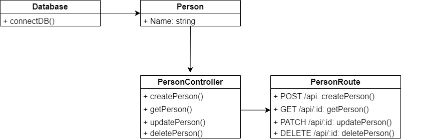

# HNG-x-2
## Backend Stage Two Task

### :dart: Objective

*A simple REST API capable of CRUD {create, read, update, delete}operations on a "person" resource that interfaces with a MongoDB database. It allows you to add, retrieve, update, and delete person records.*

## API Documentation

- [Documentation](./DOCUMENTATION.md)
- [Postman API Endpoints](https://documenter.getpostman.com/view/28501725/2s9YC4VtNM#a0c1230f-5055-4c9f-a768-9dbdb0d6b3db)

## Prerequisites

Before you begin, ensure you have met the following requirements:

- Node.js and npm installed on your machine.
- MongoDB installed and running locally or access to a MongoDB instance.
- Git (optional, for cloning the repository).

## Usage

1. clone project repository:

```bash
git clone https://github.com/Computewell/HNG-x.git
```

2. Navigate to the project directory:

   ```bash
   cd hng-x-2
   ```
```bash
Install dependencies:

```bash
npm install
```

Create a `.env` with the values:

```bash
MONGO_URI=<replace-with-mongodb-connection-string>
PORT=5000
```

Start up server:

```bash
npm run dev
```
## UML Diagram

Here is the UML (Unified Modeling Language) diagram representing the structure and relationships of this API's classes and models:




### API Endpoints
| Route | Description |
| --- | ----------- |
| `GET` /api/:id | Fetch a user from the database |
| `POST` /api | Create a new user |
| `PUT` /api/:id | Update a user |
| `DELETE` /api/:id | Delete a user |

- **Create a new person:**

  ```http
  POST /api

  Request Body:
  {
    "name": "Ololade Akinloye"
  }
  ```

- **Retrieve details of a person:**

  ```http
  GET /api/:id
  ```

- **Update details of an existing person:**

  ```http
  PATCH /api/:id

  Request Body:
  {
    "name": "Updated Name"
  }
  ```

- **Remove a person:**

  ```http
  DELETE /api/:id
  ```

## Testing

To test the API endpoints, you can use tools like Postman or write automated tests using testing libraries like Mocha and Chai. Ensure that you have the necessary testing environment set up.